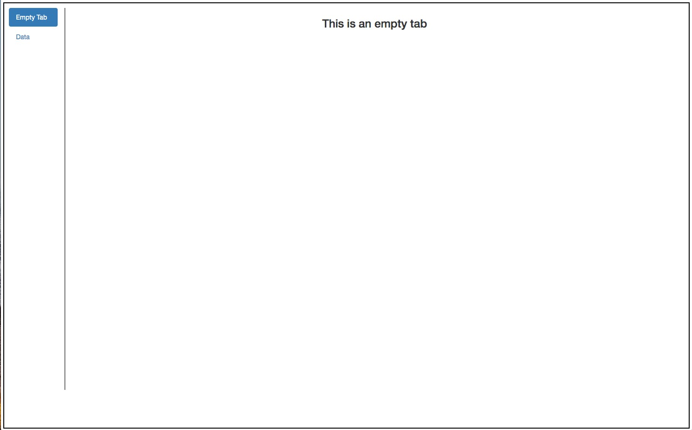
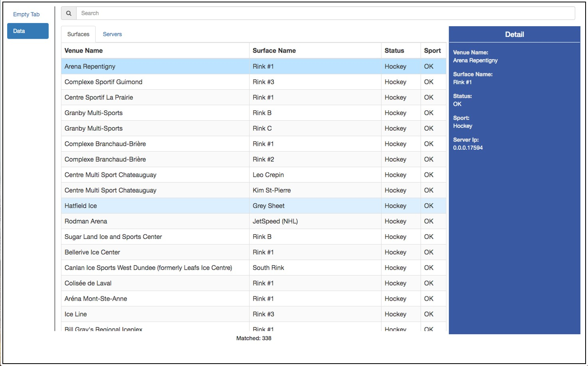
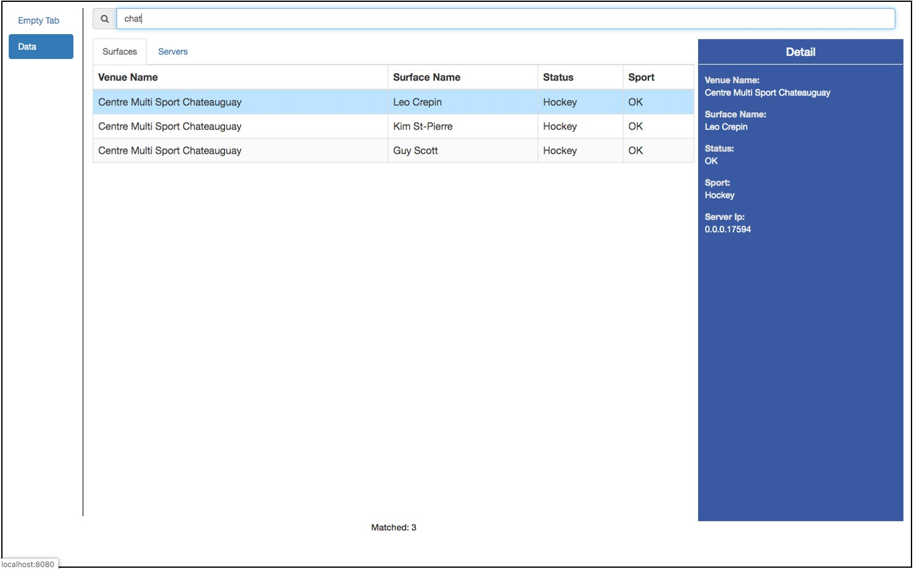
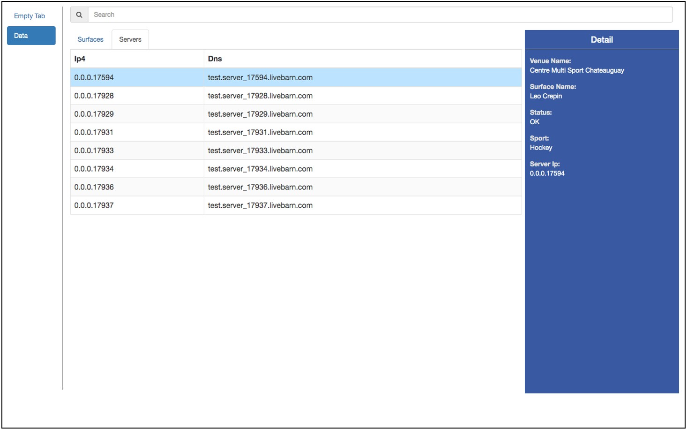
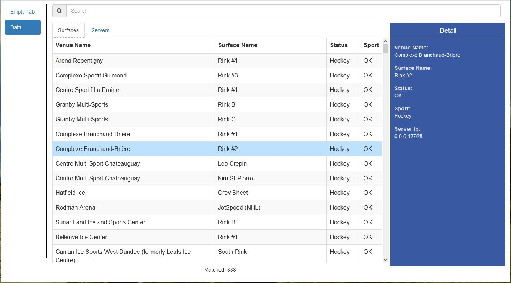
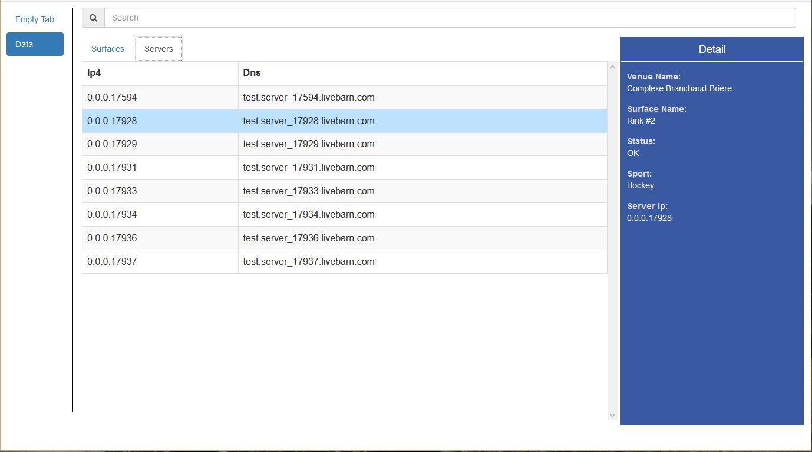
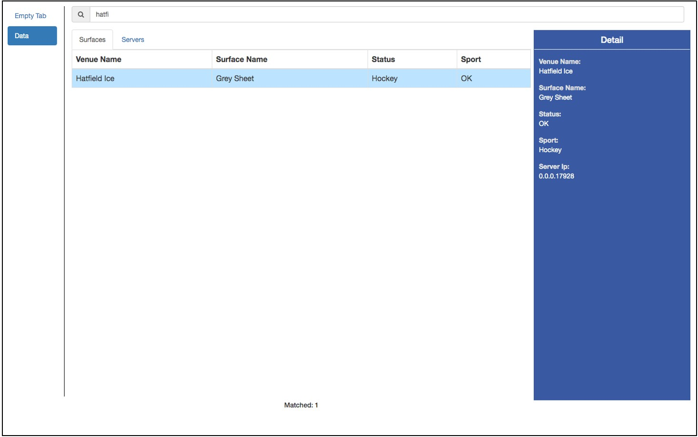
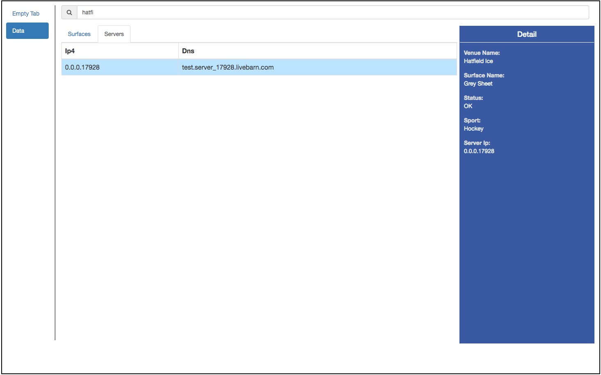
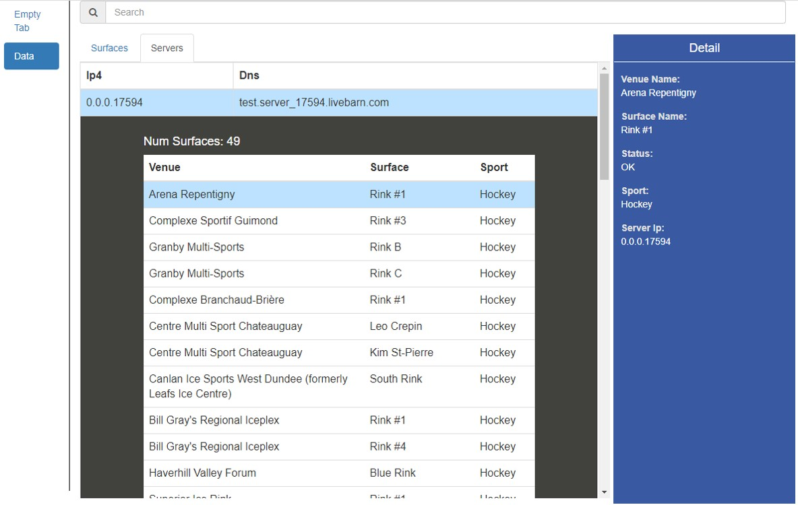

# LiveBarn Front-end Developer Interview Code Challenge #

Welcome to LiveBarn Front-end Developer Interview Code Challenge. In this code challenge, you will be asked to build a web application, which is a mini version of one of the existing applications in our company. 

## Introduction ##

As you probably already know that we install our hardware devices in various locations to provide the streaming service on multiple sports. 
Thus, this web application serves as a management tool to allow us to monitor our service status in these locations. 

For a further breakdown, a location is a `Venue` with one or multiple `Surfaces`. 

For example, **Downtown Sports Center, Basketball Court A**.
**Downtown Sports Center** is the `Venue`, and **Basketball Court A** is one of the `Surfaces`.

To provide streaming services, each of these locations is assigned to a server that handles the streaming.

## Requirements ##

1. This web application should be built using **React-Js**.
2. Use **relative paths** for all your asset files (js, css, png.etc).
3. UI Component libraries are allowed, such as React Bootstrap, Material UI.etc.
4. You can use a different color theme, be creative.
5. Please upload your code to your online repository and provide us with the link.

### Demo ###

Basic features

Bonus feature

### 1. Layout ###

Two tabs at left:

    - Empty Tab: Show "This is an empty tab" when selected
    - Data Tab: Detail as below

### 2. Data ###

When Data tab is selected, show the following components:

1. Search bar
2. Two tabs: **Surfaces** and **Servers**
3. A panel that displays information
4. Get the JSON data by making a HTTP `GET` request to `https://2hsjstzo71.execute-api.us-east-1.amazonaws.com/prod/livebarn-interview-project`

### 3. Surfaces ###

The Surfaces tab contains the following features:

1. Display the columns as indicated. 
2. Display the data of the **selected** row on **Detail** panel on the right. 

3. Filter the rows by the search text entered in the Search bar.
4. Show the number of rows that matches the search.

### 4. Servers ###

The **Servers** tab, show a table that represents a list of **unique** server objects parsed from the JSON data obtained in the **Surfaces** tab.

### 5. Selection ###

When a surface row is selected in the **Surfaces** tab, the corresponding server row should also be selected in the **Servers** tab.

### 6. Servers Filtering ###

When a search text is entered, only the matching rows from both the surfaces table and the servers table are displayed.

### Bonus Feature 1: Embedded Data ###

When clicking on one of the rows in the **Servers** tab, the row expands to show the following embedded content:

1. The total number of surfaces assigned to the same server.
2. A table of surfaces assigned to the same server.
3. The selection of the surface can either be changed from the embedded table of a server or from the table in the **Surfaces** tab.

The row becomes collapsed when clicked again.

### Bonus Feature 2: Polling and Update ###

Schedule a repeating task to fetch the JSON data every 60 seconds and update the UI accordingly.

## Evaluation ##
1. Code completion and correctness
2. Code brevity and clarity
3. Code efficiency and readability

